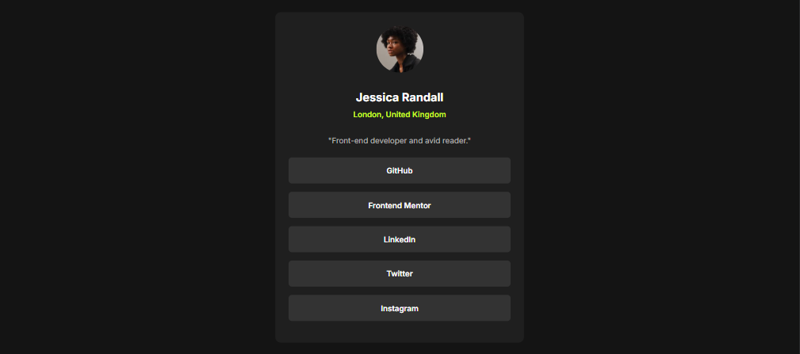

# Social Links Profile

## Overview
This project is a **Social Links Profile** challenge from Frontend Mentor. It is a responsive profile card that displays a user’s social links in a clean, modern layout. The project demonstrates skills in **HTML, CSS, and basic responsive design**.

---

## Screenshot

### Desktop
  

---

## Live Demo
[Solution URL] https://github.com/fikki008/social-links-profile.git 

[Live Site URL](https://yourusername.github.io/social-links-profile/)  

---

## Features
- Responsive design for desktop and mobile  
- Clean profile card layout  
- Social links with clickable icons  
- Simple and modern design  

---

## Built With
- HTML5  
- CSS3 (Flexbox, transitions)  
- Google Fonts 

---

Author

Your Name – @fikki008

Challenge inspired by Frontend Mentor

